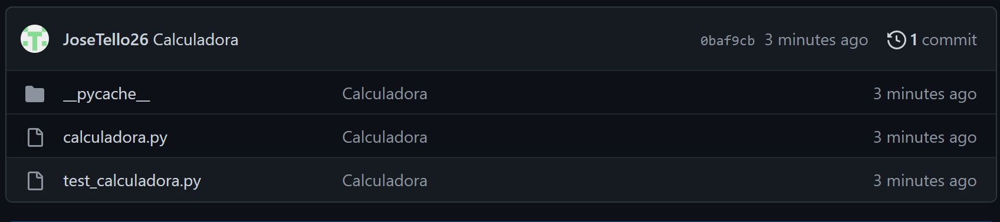

# Examen Final

1. Los clientes se conectan a una sola interfaz de red del servidor con los microservicios y este se encarga de redirigir la dirección y el puerto al microservicio especificado
2. -
3. -
4. - Dado que las instancias de microservicios deben ser idénticas en su mayoría, bastaría con hacer un commit del contenedor docker donde se están ejecutando, y esa imagen creada se podría usar para crear nuevos contenedores.
   - Se puede actualizar la imagen y luego volver a cear las instancias de microservicios
5. - Se podría tener un  volumen compartido en el directorio de todos los archivos log, así cada microservicio escribiría su log en una sola carpeta
   - Se revisaría en la carpeta compartida el log de la instancia deseada
   - Si se escribieran logs en una carpeta compartida se revisaría el log de cada instancia hasta encontrar la que dio error
6. - 

## Actividades

1. Para ejecutar couchdb en docker se ejecuta el comando :

   ```bash
   docker run -d -p 5984:5984 -e COUCHDB_USER=admin -e COUCHDB_PASSWORD=admin couchdb
   ```

   Luego confirmamos a través de la terminal que el contenedor es accesible mediante el comando:

   ```bash
   curl localhost:5984
   ```

   

2. Para crear una aplicación con Flask primero se debe instalar mediante el comando `pip install flask`. Luego se crea un archivo de python con las instrucciones necesarias para que flask escuche solicitudes y retorne un archivo html

   

   Luego se crea un archivo Dockerfile para crear una imagen de docker con los requisitos para la aplicación 

   

   Se crea la imagen

   

   Se ejecuta el contenedor basado en la imagen creada con el puerto 8080 expuesto

   

   Se verifica que es accesible a través del puerto 8080

   

3. - a) Dockerfile del maestro Jenkins

     

   - b) Creación de imagen y ejecución del contenedor con el maestro

     

   - c) Dockerfile del agente docker de Jenkins

     
   
   - d) Creación de imagen agente a partir de dockerfile
   
     
   
   - e) Configuración del agente Docker en el mismo host que ejecuta Jenkins
   
     
   
4. - a) Creación de pipeline HolaMundo-Ruby

     

   - b) y c) Instrucciones del pipeline

     ```groovy
     pipeline {
         agent any
         stages {
             stage('Hello') {
                 steps {
                     sh "echo \"puts 'Hola Mundo en Ruby'\" > hola.rb"
                     sh "ruby hola.rb"
                 }
             }
         }
     }
     ```

   - d) 

5. - Archivos `calculadora.py` y `test_calculadora.py`

     ```python
     # calculadora.py
     import sys
     
     def suma(x,y):
         return x+y
     def resta(x,y):
         return x-y
     def multiplicacion(x,y):
         return x*y
     def division(x,y):
         if(y != 0):
             return x/y
         else:
             print("ERROR: El divisor no debe ser 0")
             return -1
     
     if __name__ == '__main__':
         if  len(sys.argv)!=3:
             raise Exception("Ingrese solo 2 números como parámetro")
     
         a = int(sys.argv[1])
         b = int(sys.argv[2])
     
         print(f'Suma: \t{a} + {b} = {suma(a,b)}')
         print(f'Resta: \t{a} - {b} = {resta(a,b)}')
         print(f'Mult: \t{a} * {b} = {multiplicacion(a,b)}')
         print(f'Div: \t{a} / {b} = {division(a,b):.3f}')
     ```

     ```python
     # test_calculadora.py
     import unittest
     from calculadora import suma, resta, multiplicacion, division
     
     class TestCalculadora(unittest.TestCase):
     
         def test_suma(self):
             '''Prueba de suma'''
             self.assertEqual(suma(3,2), 3+2)
     
         def test_resta(self):
             '''Prueba de resta'''
             self.assertEqual(resta(3,2), 3-2)
     
         def test_multiplicacion(self):
             '''Prueba de multiplicacion'''
             self.assertEqual(multiplicacion(3,2), 3*2)
         def test_division(self):
             '''Prueba de division'''
             self.assertEqual(division(3,2), 3/2)
             self.assertEqual(division(3,0), -1)
     if __name__ == '__main__':
         unittest.main()
     ```

   - 

   - 

   - 

6. - Jenkinsfile del pipeline creado

     

   - Pipeline en ejecución

     

7. - Archivo `deployment.yaml` con la imagen de la aplicación HolaMundo hecha en flask:

     

   - Archivo `service.yaml` exponiendo el puerto 8080 de los nodos

     

   - Cluster creado con 3 nodos y el servicio que los conecta al exterior:

     

   - Funcionamiento correcto del cluster

     

   - 
