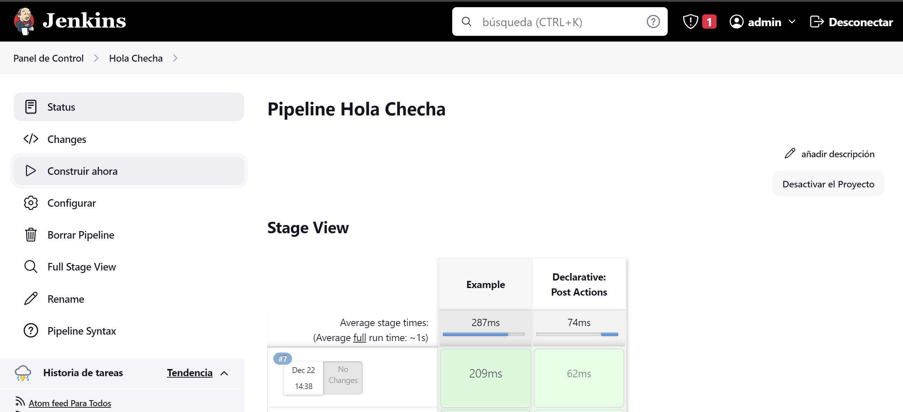

# Actividad 21

1. Ejecución del pipeline "Hello World" con 2 etapas:

   

2. Ejecución del pipeline "Hola Checha"

   

   Con la salida en la línea de comandos:

   ```bash
   Started by timer
   [Pipeline] Start of Pipeline
   [Pipeline] node
   Running on Jenkins in /var/jenkins_home/workspace/Hola Checha
   [Pipeline] {
   [Pipeline] timeout
   Timeout set to expire in 5 min 0 sec
   [Pipeline] {
   [Pipeline] stage
   [Pipeline] { (Example)
   [Pipeline] withEnv
   [Pipeline] {
   [Pipeline] echo
   Hola Checha
   [Pipeline] script
   [Pipeline] {
   [Pipeline] echo
   Prueba el chromebrowser.
   [Pipeline] echo
   Prueba el firefoxbrowser.
   [Pipeline] }
   [Pipeline] // script
   [Pipeline] }
   [Pipeline] // withEnv
   [Pipeline] }
   [Pipeline] // stage
   [Pipeline] stage
   [Pipeline] { (Declarative: Post Actions)
   [Pipeline] echo
   Hola muchas gracias
   [Pipeline] }
   [Pipeline] // stage
   [Pipeline] }
   [Pipeline] // timeout
   [Pipeline] }
   [Pipeline] // node
   [Pipeline] End of Pipeline
   Finished: SUCCESS
   ```

3. Ejecución exitosa del Pipeline "Calculator", el cual tiene la función de obtener el código del repositorio `https://github.com/JoseTello26/Calculator.git`

   

4. Error de compilación del proyecto descargado de Java Spring Boot

   