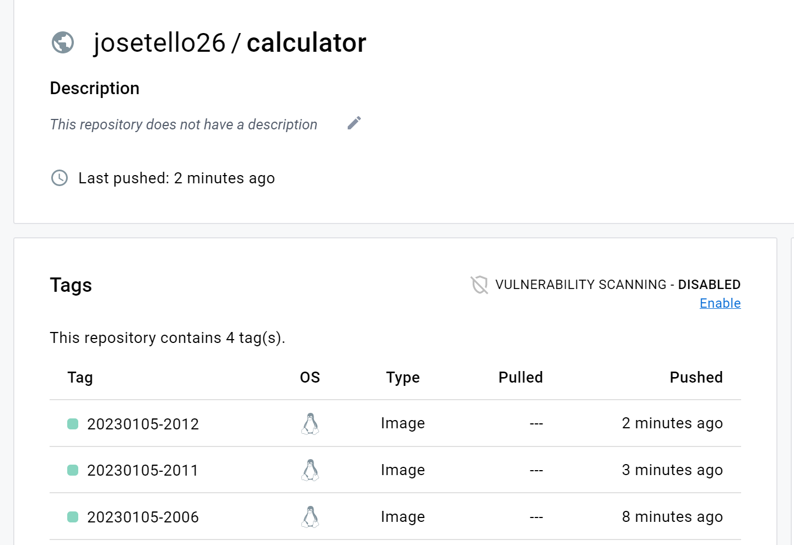
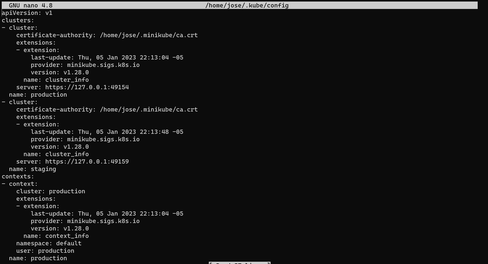
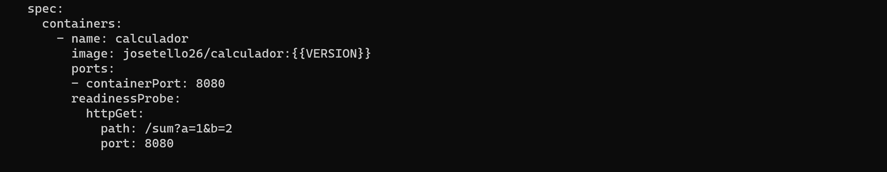
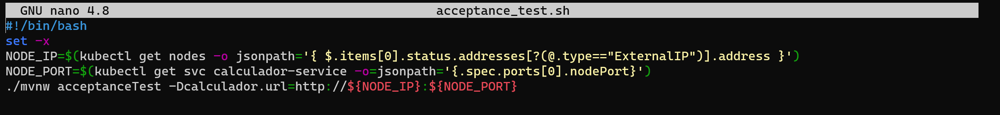

# Práctica Calificada N° 5

## Pregunta 1

- ## Actividad 23

  - Creación de imagen de docker-registry

    

  - Creación de restricción de acceso

    

  - Creando imagen docker

    

  - Subiendo imagen a dockerhub

    

  - ### Pruebas de aceptación en Jenkins

    - Creacion de Dockerfile que usa el archivo `.jar` del proyecto `calculator` para crear un contenedor con la aplicación.

      

    - Contenedor docker construido satisfactoriamente

      

    - Verificación a través del navegador de que la aplicación se ejecuta correctamente

      

    - Contenido actual del archivo Jenkinsfile con todas las etapas del pipeline:

      ```
      pipeline {
      	agent any
      	stages {
      		stage("Compile") {
      			steps {
      				dir("calculator"){
      					sh "JAVA_HOME='/usr/lib/jvm/java-17-openjdk-amd64' mvn compile"
      				}
      			}
      		}
      		stage("Unit test") {
      			steps { 
      				dir("calculator"){
      					sh "JAVA_HOME='/usr/lib/jvm/java-17-openjdk-amd64' mvn test"
      				}
      			}
      		}
      		stage("Code coverage") {
      			steps {
      				publishHTML (target: [
      					reportDir: 'calculator/target/site/jacoco',
      					reportFiles: 'index.html',
      					reportName:"JaCoCo Report"
      				])
      			}
      		}
      		stage("Static code analysis") {
      			steps {
      				dir("calculator"){
      					sh "JAVA_HOME='/usr/lib/jvm/java-17-openjdk-amd64' mvn checkstyle:checkstyle"
      				}
      				publishHTML (target: [
      					reportDir: 'calculator/target/site',
      					reportFiles: 'checkstyle.html',
      					reportName:"Checkstyle Report"
      				])
      			}
      		}
      		stage("Package") {
      			steps {
      				dir("calculator"){
      					sh "JAVA_HOME='/usr/lib/jvm/java-17-openjdk-amd64' mvn package"
      				}
      			}
      		}
      		stage("Docker build") {
      			steps {
      				sh "docker build -t checha/calculator ."
      			}
      		}
      	}
      	post {
      		always {
      			mail to: 'jose.tello.l@uni.pe',
      			subject:"Completed Pipeline: ${currentBuild.fullDisplayName}",
      			body:"Your build completed, please check: ${env.BUILD_URL}"
      		}
      	}
      }
      ```

    - Pipeline ejecutado exitosamente siguiendo las etapas correspondientes
    
      
    
    - Creando la prueba de aceptación para Calculator
    
      
    
    - Pipeline con prueba de aceptación ejecutado exitosamente
    
      
    
  - ### Escribir pruebas orientadas a usuarios

    - 
    - 

- ## Actividad 24

  - Instalación de cliente Kubernetes

    

  - Inicialización de minikube

    

  - Información del cluster de kubernetes actual

    

  - Creación de cluster de kubernetes mediante archivo `deployment.yaml`

    

  - Se observan los 3 contenedores creados, como se especificó en el archivo YAML

    

  - Se obtienen los logs de cada contenedor corriendo la aplicación calculator:

    

  - Archivo `service.yaml` para crear el servicio a traves del cual se accederá a los contenedores creados

    

    

  - Se observa que se puede acceder a Calculator a través de la ip de minikube usando el puerto 32731

    

  - ### Kubernetes avanzado

    - Escalando el servicio del proyecto 

      

    - **Actualización de aplicación:** Se modifica el archivo `deployment.yaml` y se vuelve a construir la aplicación. Luego de esto, se observa que se han eliminado los contenedores anteriores.

      

    - **Actualizaciones continuas:** Se busca que cada contenedor se elimine uno por uno y se lanze su nueva version hasta que todos los contenedores antiguos hayan sido reemplazados. Para ello se edita el archivo `deployment.yaml`

      

      Los contenedores se actualizan uno por uno

      

      Se eliminan los recursos creados

      

  - ### Dependencias de la aplicación

    - Se definen los recursos de despliegue y servicio de Hazelcast en el archivo `hazelcast.yaml`

      

      

      

    - ### Implementación del sistema multiaplicación

      - 

      - 

      - Enviando la imagen con el proyecto compilado a dockerhub

        

      - Ejecución de calculador en minikube

        

      - Probando la solicitud hacia la aplicación Calculador:

        

## Pregunta 2

- **Pregunta 1:** Se puede configurar a los agentes con claves SSH de manera directa, configurar una clave SSH dentro de la imagen de cada agente, guardar las credenciales dentro de Jenkins para usarlas luego en el pipeline o copiar la llave SSH a los agentes de Jenkins mediante un plugin al inicio de la construcción del pipeline.
- **Pregunta 2:**
- **Pregunta 3:** Las pruebas de rendimiento prueban la respuesta y estabilidad del sistema. RTT (round-trip time)es la manera mas simple de hacer un test de rendimiento, el cual consiste en enviar una solicitud a un servicio web y medir el tiempo que tarda.
- **Pregunta 4:** Las pruebas de carga son aquellas que examinan el comportamiento del sistema cuando tiene muchas solicitudes a la vez, midiendo el tiempo de respuesta promedio. Su uso es común en la fase de aseguramiento de calidad del despliegue.
- **Pregunta 5:** Las pruebas de estrés determinan cuántos usuarios pueden acceder a un servicio al mismo tiempo. A diferencia de las pruebas de carga, estas pruebas no miden tiempo, sino que buscan el número máximo de usuarios que el sistema puede manejar. Sin embargo, estas pruebas llevan mucho tiempo y mas análisis, por lo que no deberían incluirse en un pipeline de CD.
- **Pregunta 6:** Las pruebas de escalabilidad miden cómo la latencia y la transferencia de datos cambian mientras se van añadiendo mas servicios al sistema. Dado que la ejecución de estas pruebas requiere de mucho análisis entre la relación de servicios añadidos con el tiempo de respuesta del sistema, resulta dificil incluirlo en un despliegue automatizado.
- **Pregunta 7:** Las pruebas de longevidad ejecutan el sistema por un largo tiempo para detectar fluctuaciones en el rendimiento, fugas de memoria o fallos en su estabilidad. Como requieren de una ejecución de larga duración, no tiene sentido incluirlo dentro de un pipeline.
- **Pregunta 8:** Las pruebas de seguridad incluyen aspectos  como autenticación, autorización y asignación de roles. Su realización es crucial para el despliegue, por lo que son requeridos en el pipeline. Pueden elaborarse como pruebas de aceptación en frameworks como BDD (desarrollo basado en el comportamiento)
- **Pregunta 9:** Las pruebas de mantenimiento determinan qué tan fácil es mantener un código, es decir, evalúan la calidad del código, hacen tests de covertura o hacen análisis de código estático.
- **Pregunta 10:** Las pruebas de recuperación miden qué tan rápido se recupera un sistema luego de un fallo de software o de hardware. Chaos Monkey es un ejemplo de una aplicación de las pruebas de seguridad, es una herramienta que detiene contenedores o máquinas virtuales dentro de un entorno de producción de manera aleatoria. Es asi que los desarrolladores se concentran mas en hacer su sistema mas resiliente a cualquier tipo de fallos

### Control de versiones en el pipeline de Jenkins

- Contenido del Jenkinsfile luego de aplicar la variable de entorno `${BUILD_TIMESTAMP}` a las etiquetas de las imagenes de Docker

  ```groovy
  pipeline {
  	agent any
  	stages {
  		stage("Compile") {
  			steps {
  				dir("calculator"){
  					sh "JAVA_HOME='/usr/lib/jvm/java-17-openjdk-amd64' mvn compile"
  				}
  			}
  		}
  		stage("Unit test") {
  			steps { 
  				sh "whoami"
  				dir("calculator"){
  					sh "JAVA_HOME='/usr/lib/jvm/java-17-openjdk-amd64' mvn test"
  				}
  			}
  		}
  		stage("Code coverage") {
  			steps {
  				publishHTML (target: [
  					reportDir: 'calculator/target/site/jacoco',
  					reportFiles: 'index.html',
  					reportName:"JaCoCo Report"
  				])
  			}
  		}
  		stage("Static code analysis") {
  			steps {
  
  				dir("calculator"){
  					sh "JAVA_HOME='/usr/lib/jvm/java-17-openjdk-amd64' mvn checkstyle:checkstyle"
  				}
  				publishHTML (target: [
  					reportDir: 'calculator/target/site',
  					reportFiles: 'checkstyle.html',
  					reportName:"Checkstyle Report"
  				])
  			}
  		}
  		stage("Package") {
  			steps {
  				dir("calculator"){
  					sh "JAVA_HOME='/usr/lib/jvm/java-17-openjdk-amd64' mvn package"
  				}
  			}
  		}
  		stage("Docker build") {
  			steps {
  				sh "docker build -t josetello26/calculator:${BUILD_TIMESTAMP} ."
  			}
  		}
  		stage("Docker push") {
  			steps {
  				sh "docker tag calculador josetello26/calculator:${BUILD_TIMESTAMP}"
  				sh "docker push josetello26/calculator:${BUILD_TIMESTAMP}"
  			}
  		}
  		stage("Deploy to staging") {
  			steps {
  				sh "docker run -d --rm -p 8765:8080 --name calculator josetello26/calculator:${BUILD_TIMESTAMP}"
  			}
  		}
  		stage("Acceptance test") {
  			steps {
  				sleep 60
  				sh "chmod +x acceptance_test.sh && ./acceptance_test.sh"
  			}
  		}
  	}
  	post {
  		always {
  			sh "docker stop calculator"
  		}
  	}
  }
  ```

  

### Inventario

- Se crean dos clusters con Minikube: Uno llamado "production" que servirá para el código listo para lanzarse, y el otro "staging", para el código en estado de prueba

- Archivo de configuración de los clusteres "production" y "staging"

  

### Versionado

- Las imágenes de docker se suben con marcas de tiempo de compilación del pipeline

- Actualización en Jenkinsfile

  ```groovy
  stage("Docker push") {
  			steps {
  				sh "docker tag calculador josetello26/calculator:${BUILD_TIMESTAMP}"
  				sh "docker push josetello26/calculator:${BUILD_TIMESTAMP}"
  			}
  		}
  ```

- Archivo `deployment.yaml` actualizado para usar el versionamiento:

  

### Entorno staging remoto

- Se ejecutan los nodos configurados en el agente Jenkins

- Actualización en Jenkinsfile:

  ```groovy
  stage("Deploy to staging") {
  			steps {
  				sh "kubectl config get-contexts"
  				sh "kubectl config use-context staging"
  				sh "kubectl apply -f hazelcast.yaml"
  				sh "kubectl apply -f deployment.yaml"
  				sh "kubectl apply -f service.yaml"
  			}
  		}
  ```

### Entorno de pruebas de aceptación

- Se ejecuta la prueba de aceptación de calculador en los contenedores de kubernetes

- Actualización de Jenkinsfile:

  ```groovy
  stage("Acceptance test") {
  			steps {
  				sleep 60
  				sh "chmod +x acceptance_test.sh && ./acceptance_test.sh"
  			}
  		}
  ```

- Actualización de `acceptance_test.sh`

  

### Lanzamiento

- Una vez aprobada la prueba de aceptación, se cambia el contexto de los clusters al de producción y se procede a modificar dicho entorno.

- Actualización de Jenkinsfile:

  ```groovy
  stage("Release") {
  			steps {
  				sh "kubectl config use-context production"
  				sh "kubectl apply -f hazelcast.yaml"
  				sh "kubectl apply -f deployment.yaml"
  				sh "kubectl apply -f service.yaml"
  			}
  		}
  ```

- 

Archivo Jenkinsfile final:

```groovy
pipeline {
	agent any
	stages {
		stage("Compile") {
			steps {
				dir("calculator"){
					sh "kubectl config get-contexts"
					sh "chmod +x mvnw"
					sh "./mvnw compile"
				}
			}
		}
		stage("Unit test") {
			steps { 
				sh "whoami"
				dir("calculator"){
					sh "./mvnw test"
				}
			}
		}
		stage("Code coverage") {
			steps {
				publishHTML (target: [
					reportDir: 'calculator/target/site/jacoco',
					reportFiles: 'index.html',
					reportName:"JaCoCo Report"
				])
			}
		}
		stage("Static code analysis") {
			steps {

				dir("calculator"){
					sh "./mvnw checkstyle:checkstyle"
				}
				publishHTML (target: [
					reportDir: 'calculator/target/site',
					reportFiles: 'checkstyle.html',
					reportName:"Checkstyle Report"
				])
			}
		}
		stage("Package") {
			steps {
				dir("calculator"){
					sh "./mvnw package"
				}
			}
		}
		stage("Docker build") {
			steps {
				sh "docker build -t josetello26/calculator:${BUILD_TIMESTAMP} ."
			}
		}
		stage("Docker push") {
			steps {
				sh "docker tag calculador josetello26/calculator:${BUILD_TIMESTAMP}"
				sh "docker push josetello26/calculator:${BUILD_TIMESTAMP}"
			}
		}
		stage("Deploy to staging") {
			steps {
				sh "kubectl config get-contexts"
				sh "kubectl config use-context staging"
				sh "kubectl apply -f hazelcast.yaml"
				sh "kubectl apply -f deployment.yaml"
				sh "kubectl apply -f service.yaml"
			}
		}

		stage("Acceptance test") {
			steps {
				sleep 60
				sh "chmod +x acceptance_test.sh && ./acceptance_test.sh"
			}
		}
        stage("Release") {
			steps {
				sh "kubectl config use-context production"
				sh "kubectl apply -f hazelcast.yaml"
				sh "kubectl apply -f deployment.yaml"
				sh "kubectl apply -f service.yaml"
			}
		}
	}
	post {
		always {
			sh "docker stop calculator"
		}
	}
}
```

