# Práctica Calificada N° 5

## Pregunta 1

- ## Actividad 23

  - Creación de imagen de docker-registry

    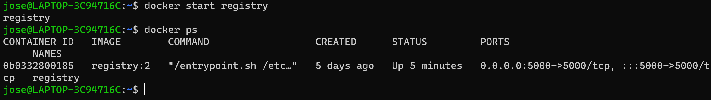

  - Creación de restricción de acceso

    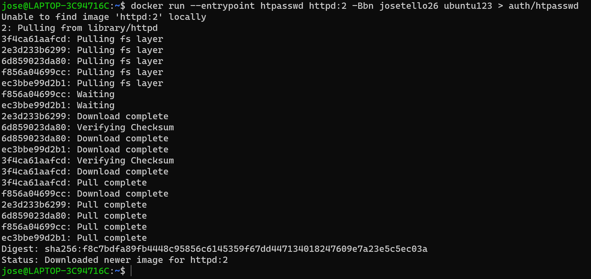

  - Creando imagen docker

    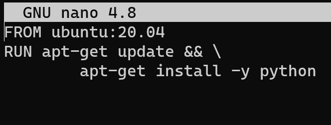

  - Subiendo imagen a dockerhub

    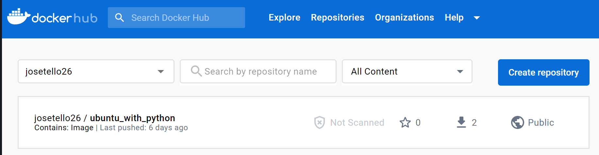

  - ### Pruebas de aceptación en Jenkins

    - Creacion de Dockerfile que usa el archivo `.jar` del proyecto `calculator` para crear un contenedor con la aplicación.

      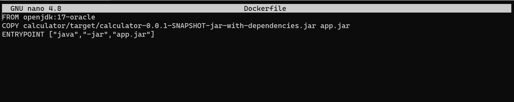

    - Contenedor docker construido satisfactoriamente

      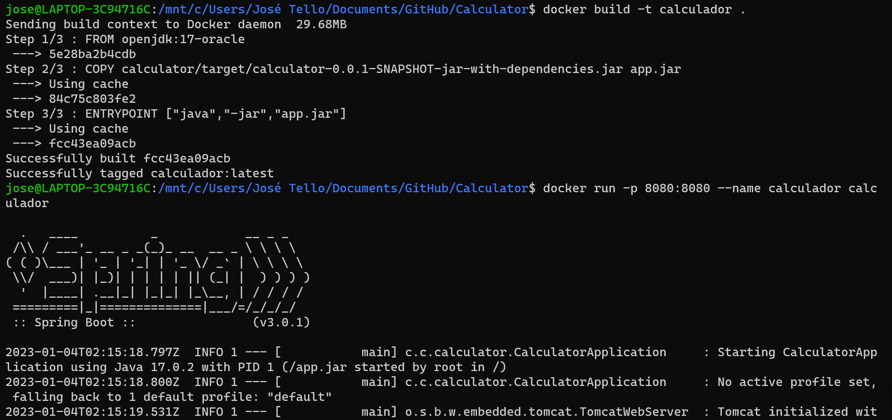

    - Verificación a través del navegador de que la aplicación se ejecuta correctamente

      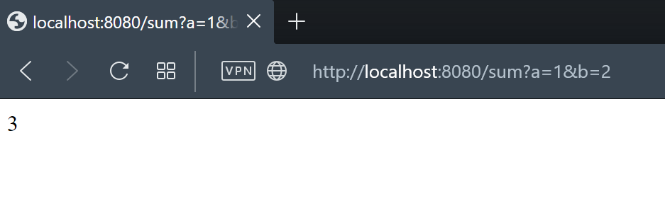

    - Contenido actual del archivo Jenkinsfile con todas las etapas del pipeline:

      ```
      pipeline {
      	agent any
      	stages {
      		stage("Compile") {
      			steps {
      				dir("calculator"){
      					sh "JAVA_HOME='/usr/lib/jvm/java-17-openjdk-amd64' mvn compile"
      				}
      			}
      		}
      		stage("Unit test") {
      			steps { 
      				dir("calculator"){
      					sh "JAVA_HOME='/usr/lib/jvm/java-17-openjdk-amd64' mvn test"
      				}
      			}
      		}
      		stage("Code coverage") {
      			steps {
      				publishHTML (target: [
      					reportDir: 'calculator/target/site/jacoco',
      					reportFiles: 'index.html',
      					reportName:"JaCoCo Report"
      				])
      			}
      		}
      		stage("Static code analysis") {
      			steps {
      				dir("calculator"){
      					sh "JAVA_HOME='/usr/lib/jvm/java-17-openjdk-amd64' mvn checkstyle:checkstyle"
      				}
      				publishHTML (target: [
      					reportDir: 'calculator/target/site',
      					reportFiles: 'checkstyle.html',
      					reportName:"Checkstyle Report"
      				])
      			}
      		}
      		stage("Package") {
      			steps {
      				dir("calculator"){
      					sh "JAVA_HOME='/usr/lib/jvm/java-17-openjdk-amd64' mvn package"
      				}
      			}
      		}
      		stage("Docker build") {
      			steps {
      				sh "docker build -t checha/calculator ."
      			}
      		}
      	}
      	post {
      		always {
      			mail to: 'jose.tello.l@uni.pe',
      			subject:"Completed Pipeline: ${currentBuild.fullDisplayName}",
      			body:"Your build completed, please check: ${env.BUILD_URL}"
      		}
      	}
      }
      ```

    - Pipeline ejecutado exitosamente siguiendo las etapas correspondientes
    
      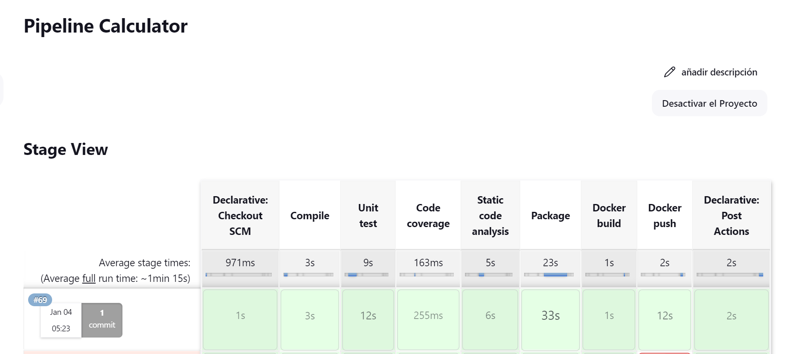
    
    - Creando la prueba de aceptación para Calculator
    
      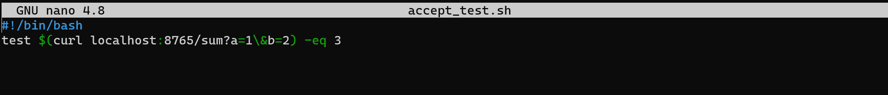
    
    - Pipeline con prueba de aceptación ejecutado exitosamente
    
      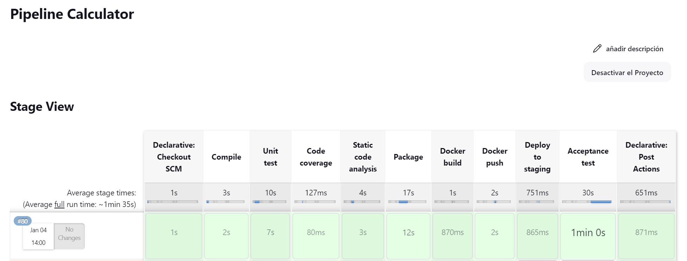
    
  - ### Escribir pruebas orientadas a usuarios

    - 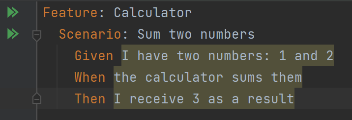
    - 

- ## Actividad 24

  - Instalación de cliente Kubernetes

    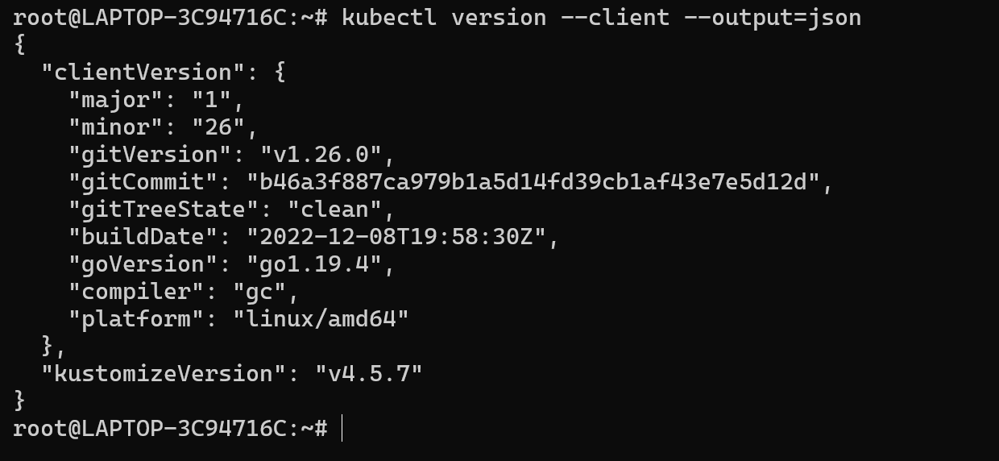

  - Inicialización de minikube

    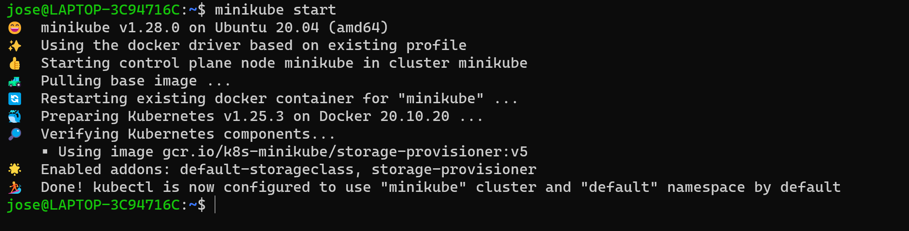

  - Información del cluster de kubernetes actual

    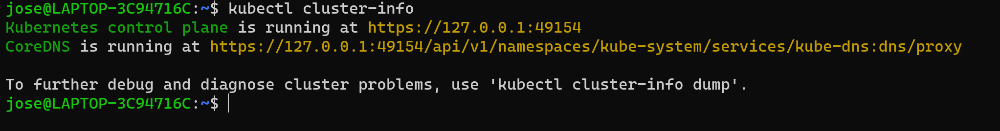

  - Creación de cluster de kubernetes mediante archivo `deployment.yaml`

    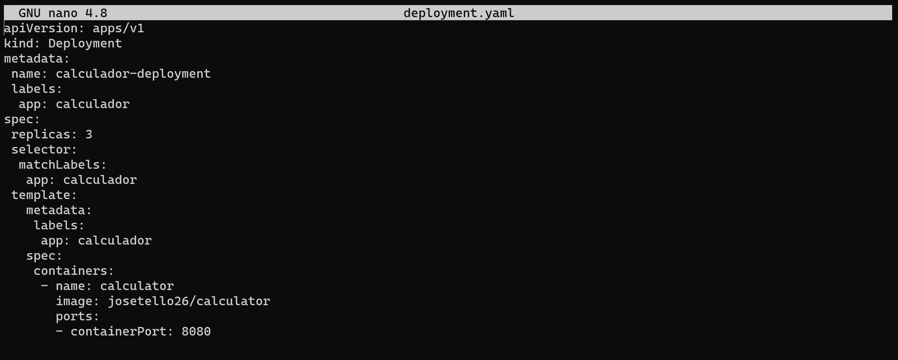

  - Se observan los 3 contenedores creados, como se especificó en el archivo YAML

    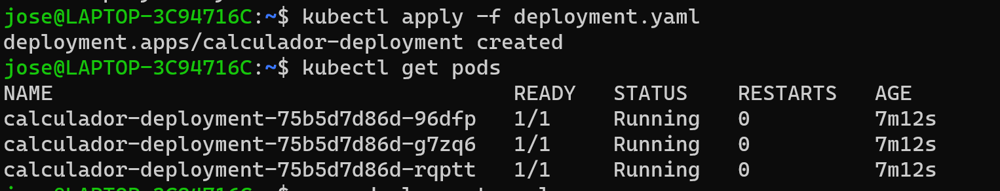

  - Se obtienen los logs de cada contenedor corriendo la aplicación calculator:

    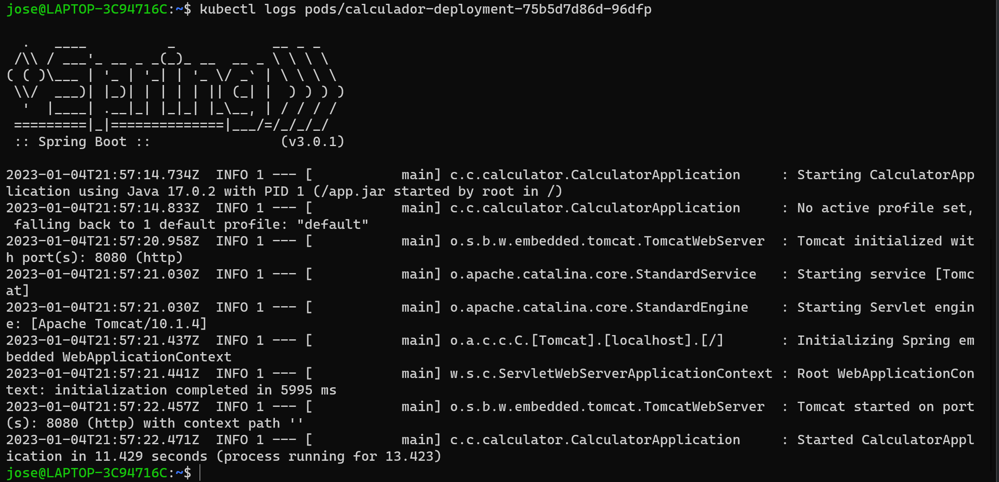

  - Archivo `service.yaml` para crear el servicio a traves del cual se accederá a los contenedores creados

    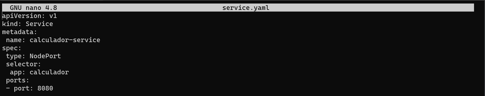

    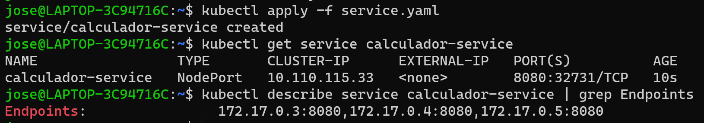

  - Se observa que se puede acceder a Calculator a través de la ip de minikube usando el puerto 32731

    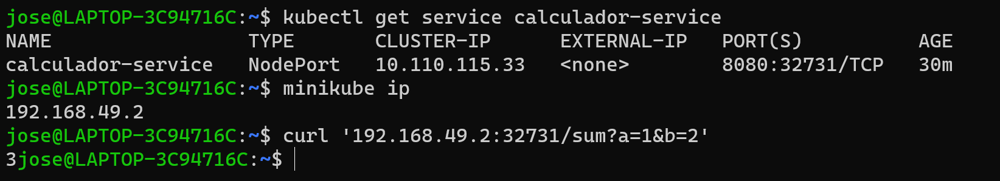

  - ### Kubernetes avanzado

    - Escalando el servicio del proyecto 

      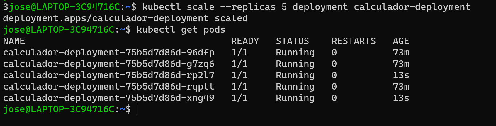

    - **Actualización de aplicación:** Se modifica el archivo `deployment.yaml` y se vuelve a construir la aplicación. Luego de esto, se observa que se han eliminado los contenedores anteriores.

      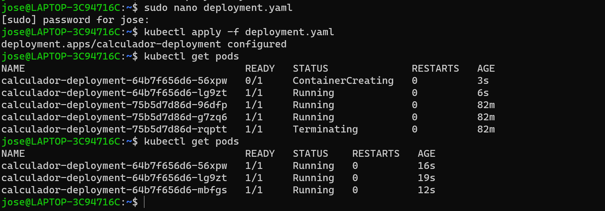

    - **Actualizaciones continuas:** Se busca que cada contenedor se elimine uno por uno y se lanze su nueva version hasta que todos los contenedores antiguos hayan sido reemplazados. Para ello se edita el archivo `deployment.yaml`

      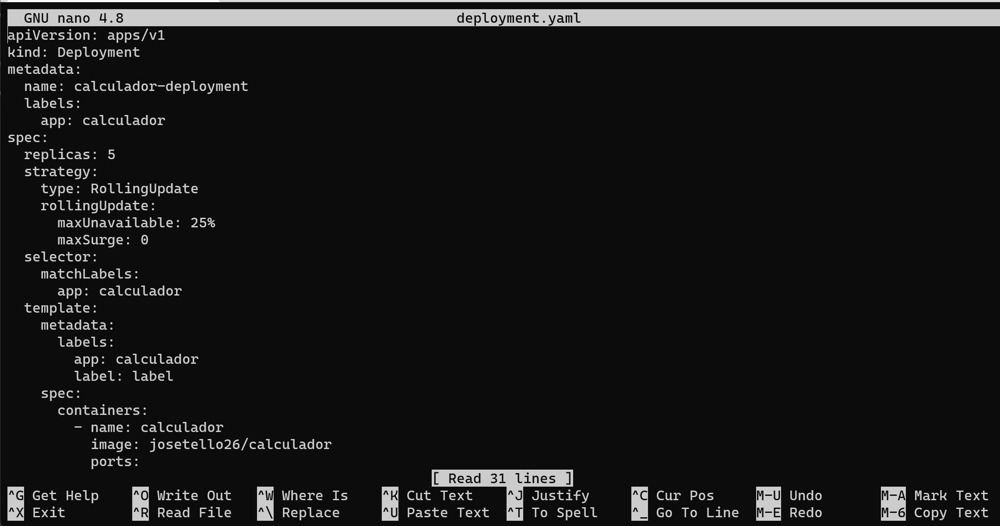

      Los contenedores se actualizan uno por uno

      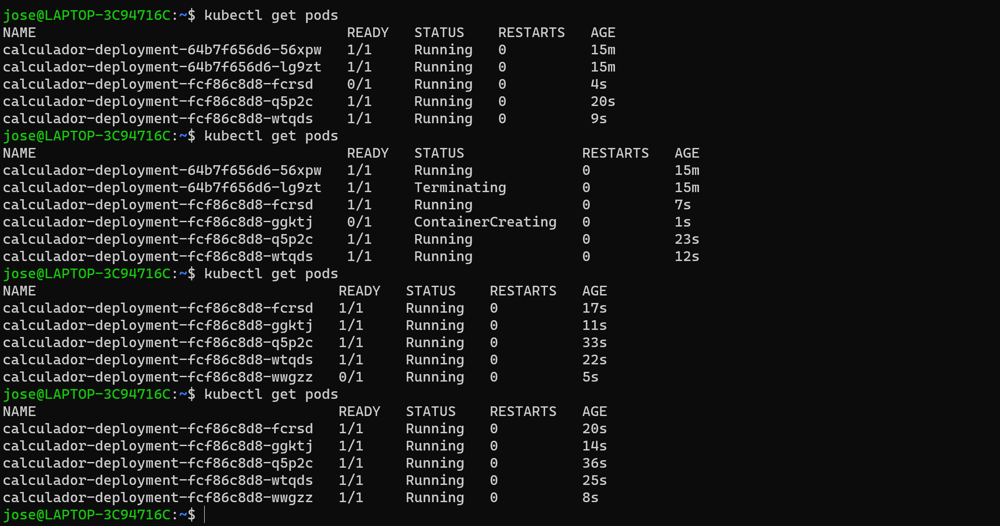

      Se eliminan los recursos creados

      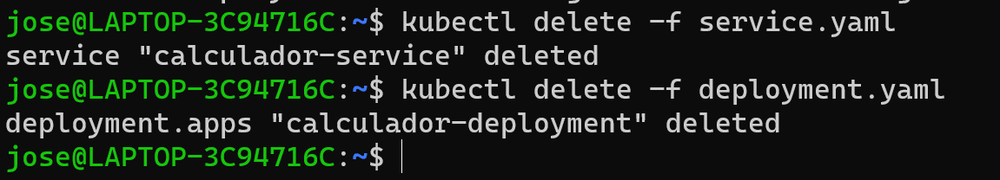

  - ### Dependencias de la aplicación

    - Se definen los recursos de despliegue y servicio de Hazelcast en el archivo `hazelcast.yaml`

      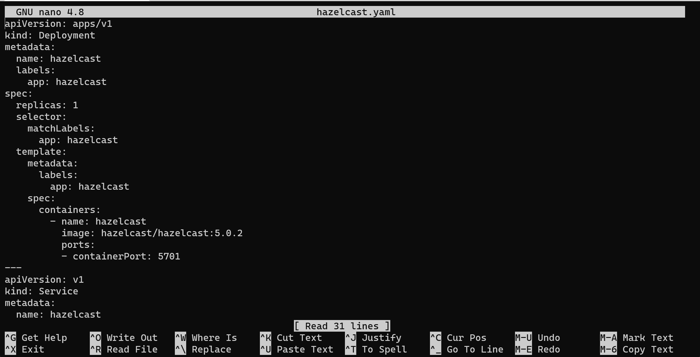

      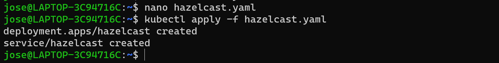

      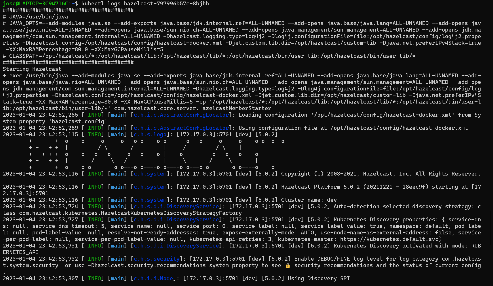

    - ### Implementación del sistema multiaplicación

      - 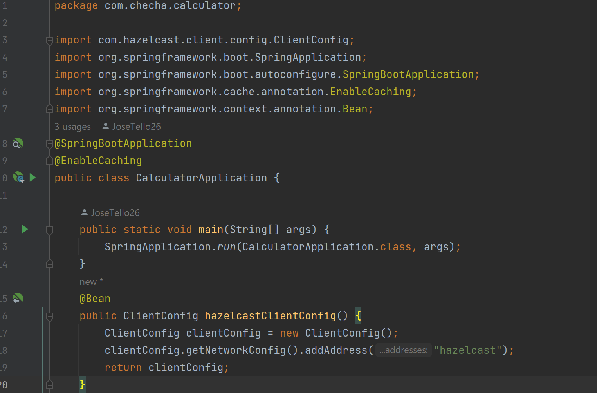

      - 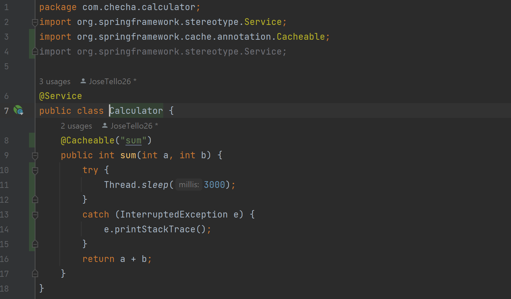

      - Enviando la imagen con el proyecto compilado a dockerhub

        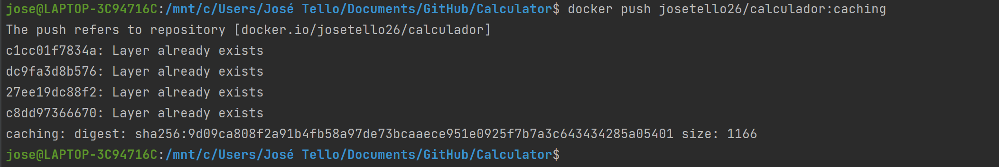

      - Ejecución de calculador en minikube

        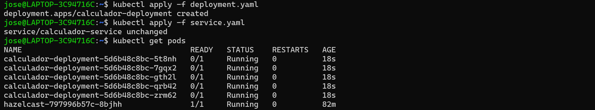

      - Probando la solicitud hacia la aplicación Calculador:

        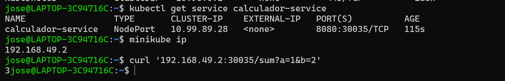

        